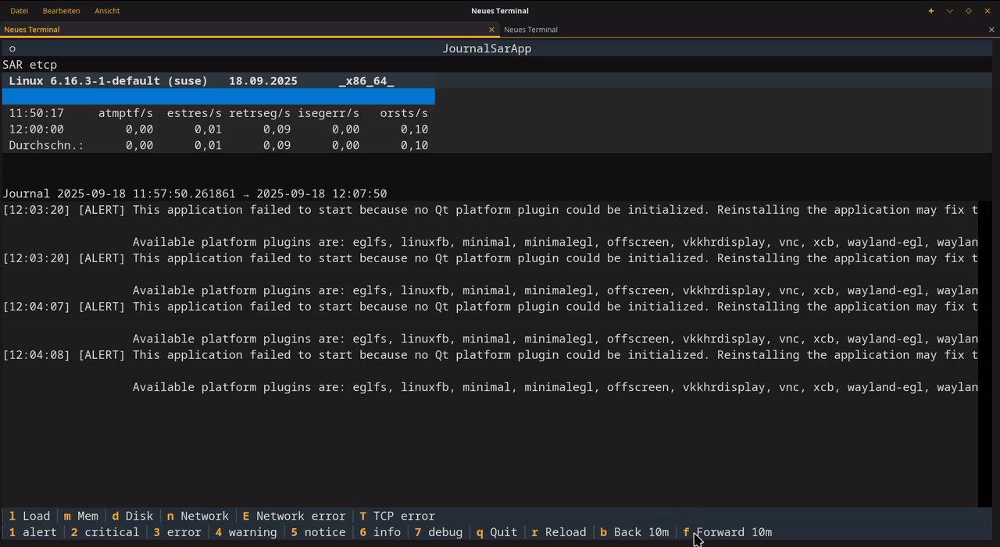

```{=org}
#+PROPERTY: header-args:python :session *Python* :results output
```
# sar-journal {#sar-journal-1}

A Textual TUI application to display Linux journal entries aside with
system performance metrics from **sysstat (sar)** in 10 Minutes
portions. You can then move back and forward in time to look if events
and unusual stats correlate.

> ⚠️ Disclaimer: This is a proof of concept built by a hobbyist. It is
> not a production-ready monitoring solution. Use at your own risk.

```{=org}
#+ATTR_HTML: :width 80%
```
```{=org}
#+ATTR_LATEX: :width .65\linewidth :placement [!htpb]
```
```{=org}
#+ATTR_ORG: :width 700
```


This package provides:

- Real-time journal monitoring (via `journalctl`)
- CPU, Load, Memory, Disk, and Network metrics (via `sadf/sar`)
- Interactive Textual UI (keyboard shortcuts for navigation, filtering,
  etc.)
- Simple Python packaging for installation with `uv`, `pyenv`, or `venv`

# Project Structure

``` text
sar_journal/
├── pyproject.toml     # Project metadata
├── README.org         # This file
├── src/
│   └── sar_journal/
│       ├── __init__.py
│       ├── config.py     # Config and timestamp parsing
│       ├── constants.py  # Priority/metric presets
│       ├── journal.py    # Journal access
│       ├── stats.py      # Sysstat parsing
│       ├── ui.py         # Textual UI application
│       └── app.py        # Entry point
└── tests/
    └── test_basic.py
```

# Installation

You can install in a Python 3.11+ virtual environment using one of the
following tools:

## Using uv (recommended)

``` bash
uv venv .venv
source .venv/bin/activate
uv pip install -e .
```

## Using pyenv

``` bash
pyenv install 3.11
pyenv virtualenv 3.11 sar-journal
pyenv activate sar-journal
pip install -e .
```

## Using built-in venv

``` bash
python3 -m venv .venv
source .venv/bin/activate
pip install -e .
```

# Usage

Run the application from the command line:

``` bash
python -m sar_journal.app --time "2025-08-30 14:00"
```

or just

``` bash
sar-journal --time "2025-08-30 14:00"
```

Without the `--time` argument it starts 10 Minutes ago.

# Keyboard Shortcuts

`q`
:   quit

`r`
:   reload data

`1..7`
:   filter journal by priority (ALERT → DEBUG)

`c`
:   switch to CPU metrics

`l`
:   switch to Load metrics

`m`
:   switch to Memory metrics

`d`
:   switch to Disk metrics

`n`
:   switch to Network metrics

`E`
:   switch to Network device errors

`T`
:   switch to TCP errors

`b`
:   shift time window back 10 minutes

`f`
:   shift time window forward 10 minutes

# License

This program is free software: you can redistribute it and/or modify it
under the terms of the [GNU General Public License](LICENSE) as
published by the Free Software Foundation, either version 3 of the
License, or (at your option) any later version.

This program is distributed in the hope that it will be useful, but
WITHOUT ANY WARRANTY; without even the implied warranty of
MERCHANTABILITY or FITNESS FOR A PARTICULAR PURPOSE. See the GNU General
Public License for more details.

# Contact

Sebastian Meisel 📧 Email: sebastian.meisel@gmail.com
